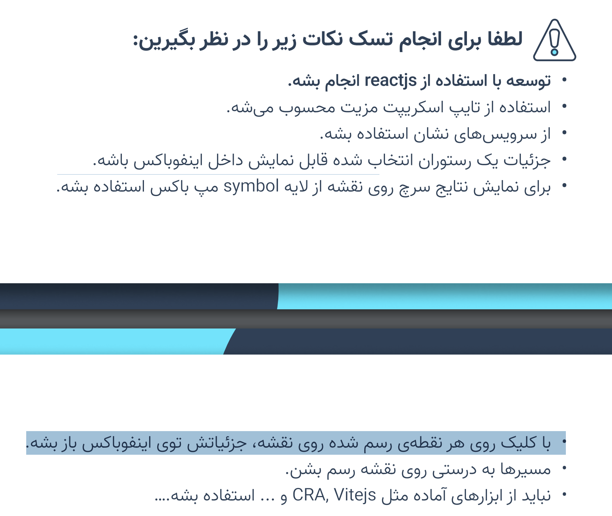

# Neshan-Interview

برای اجرای عملکرد برنامه لطفا از VPN استفاده کنید تا موقعیت مکانی فعلی به درستی نمایش داده شود.

در سرویس ها مدل ها به صورت دستی نوشته شده است راه بهتر برای این کار استفاده از DTO Generator ها میباشد.

در زمان مسیریابی اگر روی مسیر مشخص شده کلیک کنید اطلاعاتی مربوط به مسیر را مشاهده خواهید کرد.

طبق صحبت های انجام شده با واحد پشتیبانی این قابلیت در حال حاضر به صورت عمومی قابل دسترس نمیباشد.
